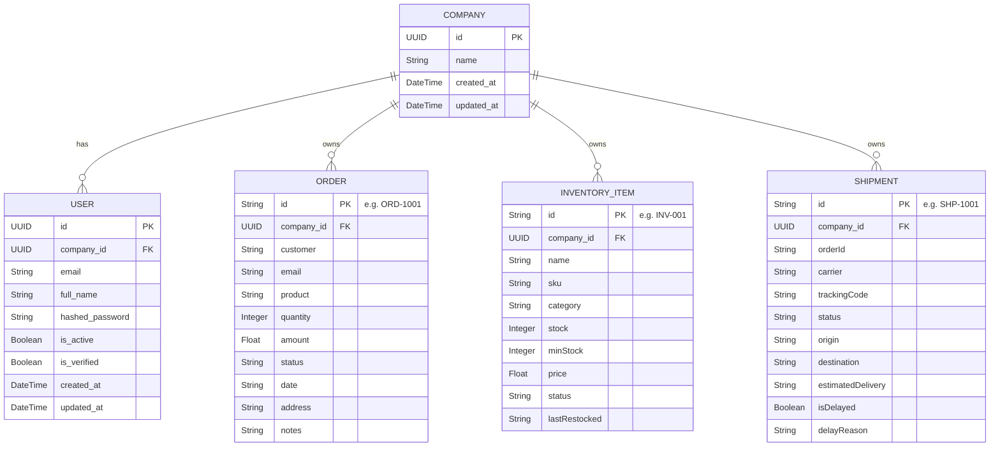
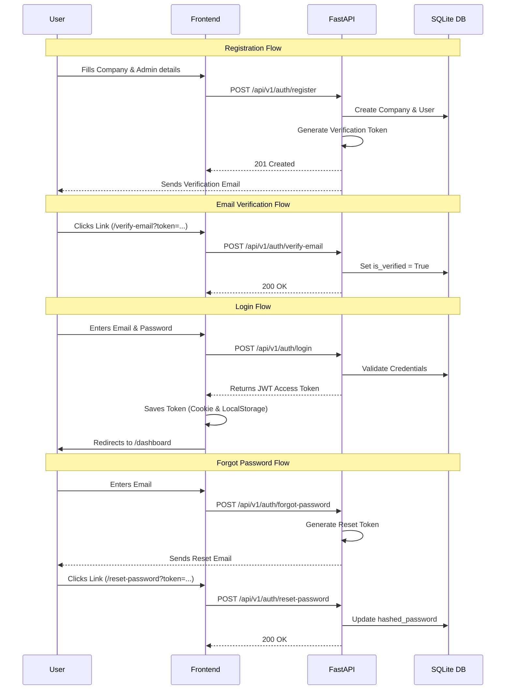

# Tesera

Tesera is an AI-powered operations assistant platform designed for SMEs, cooperatives, boutique e-commerce businesses, and hybrid physical-online sellers.

## Overview

Tesera automates:
- Customer communication (WhatsApp, Chat, Email)
- Shipment management and tracking
- Inventory and stock tracking
- Workflow operations and task assignment
- Operational analytics

## Architecture

- **Frontend:** Next.js (App Router), TypeScript, TailwindCSS, shadcn/ui.
- **Backend:** FastAPI, Python, PostgreSQL, Redis, Celery.
- **AI Layer:** OpenAI-compatible APIs, agent-based workflows, tool calling, RAG.

### API Documentation
API documentation is available automatically once the backend is running:
- **Swagger UI**: `http://localhost:8000/docs`
- **ReDoc**: `http://localhost:8000/redoc`

### Test Simülatörü (Mock Veri)
Tesera, manuel veri girişi yapmadan mock veri oluşturmanıza ve platformun özelliklerini test etmenize yardımcı olan yerleşik, etkileşimli bir simülatör içerir.

1. Yan menüden **Test Simülatörü** sayfasına gidin (`/dashboard/test`).
2. **Toplu Veri (Seed):** Veritabanını rastgele mock verilerle (4 envanter ürünü, 3 sipariş, 2 kargo) doldurmak için bu butona tıklayın. Bu butona birden fazla kez tıklayabilirsiniz; her seferinde benzersiz ID'ler üretir.
3. **Rastgele Ürün Ekle:** Envanterinize rastgele stok ve fiyatlandırma ile anında yeni bir ürün ekler.
4. **Sipariş Simülatörü:** Mevcut envanterinizi görüntüler. İlgili ürün için bir müşteri siparişi simüle etmek üzere ürünün yanındaki "Sipariş Et" butonuna tıklayın.
5. **Kargo Operasyonları:** Tüm aktif kargoları görüntüler. Taşıyıcı rolünü üstlenerek durumlarını "Yolda", "Teslim Edildi" olarak güncelleyebilir veya arayüzün nasıl tepki verdiğini görmek için "Gecikme" durumunu tetikleyebilirsiniz.

### Database Structure

Currently, the backend runs on **SQLite** (`tesera.db`) to enable rapid local development without requiring a Dockerized PostgreSQL setup. This can be easily swapped to PostgreSQL in production by modifying the `DATABASE_URL` in `.env` / `core/config.py`.

### Entity Relationship Diagram (ERD)

The platform is designed around a multi-tenant B2B architecture where every operational record is tied to a `Company`. Users authenticate to manage resources owned by their respective companies.

**Core Entities:**
- **Company:** Root tenant container. All operational data belongs to a company.
- **User:** Authenticated members. Bound to a specific `Company` and restricted to its data scope.
- **Order:** Represents customer purchase records, linked back to the owning company.
- **InventoryItem:** Products and stock tracking information, triggering reorder alerts based on `minStock`.
- **Shipment:** Logistic tracking and statuses for fulfilled orders.

### Authentication Flow

## Project Structure

- `/frontend` - Next.js application
- `/backend` - FastAPI application
- `/docker` - Docker compose and configurations (Planned)
- `/memory-bank` - Project documentation and rules (Cline's memory)

## Development Setup

### Frontend

1. `cd frontend`
2. Copy `.env.example` to `.env.local`
3. `npm install`
4. `npm run dev`

### Backend

1. `cd backend`
2. Create a virtual environment: `python -m venv venv`
3. Activate it: `source venv/bin/activate`
4. Copy `.env.example` to `.env`
5. `pip install -r requirements.txt`
6. `uvicorn app.main:app --reload`

## License

Proprietary.
