# Tesera — AI-Powered Operations Platform

> **Tesera** is a full-stack, AI-powered operations management platform built for SMEs, agricultural cooperatives, boutique e-commerce businesses, and hybrid physical-online sellers. It centralises order management, inventory tracking, shipment logistics, AI-driven insights, automated workflows, and a real-time notification system into a single, cohesive dashboard.

---

## 🔗 Links

| | |
|---|---|
| 🌐 **Live Demo** | [LIVE_DEMO_URL] |
| 🎥 **Demo Video** | [VIDEO_URL] |
| 📊 **Presentation** | [PRESENTATION_URL] |
| 📖 **API Docs (Swagger)** | `http://localhost:8000/docs` |
| 📖 **API Docs (ReDoc)** | `http://localhost:8000/redoc` |

---

## ✨ Features

### Core Modules
- **Order Management** — Create, track, filter, and update customer orders with real-time status transitions and automatic notification triggers.
- **Inventory Management** — Full product lifecycle management (create, edit, delete), CSV import/export, low-stock and critical-stock alerts.
- **Shipment Tracking** — End-to-end shipment lifecycle with carrier assignment, delay detection, and status-change notifications.
- **Analytics & Insights** — Interactive charts (order trends, inventory by category, shipment status distribution, revenue over time) powered by Recharts.

### Intelligence Layer
- **AI Assistant (Gemini + OpenAI)** — Conversational assistant at `/dashboard/ai-assistant`. Gemini 1.5 Flash primary, GPT-4o Mini fallback. Full chat history persistence, markdown rendering, and conversation management.
- **AI Recommendations** — Live contextual recommendations on the dashboard overview, analysing current company data and routing action buttons to the relevant module.
- **AI Predictions** — Dedicated analytics sidebar with business summary, performance analysis, forecasts, and profit/loss predictions with regenerate functionality.

### Automation & Notifications
- **Workflow Builder** — Visual agent workflow builder at `/dashboard/workflows`. Supports manual, scheduled, webhook, and event triggers. Step types: Send Notification, Update Inventory, Create Order, AI Action, Delay.
- **Notification Center** — Full notification lifecycle (view, mark-read, bulk-delete) at `/dashboard/notifications`. Priority-coded badges (Info, Warning, Error, Success) with type icons per module.
- **Real-time Topbar Notifications** — Notification dropdown with live badge, auto-refresh every 30 seconds, immediate UI updates.

### Platform
- **Authentication System** — JWT-based auth, Bcrypt hashing, email verification (SMTP), password reset, route protection for unverified users.
- **Onboarding Flow** — 8-step interactive onboarding for new users covering all core modules with progress tracking.
- **Settings** — Unified settings page (Profile, Preferences, Billing) with sidebar customisation, drag-and-drop reordering, theme toggle, and subscription management.
- **Integrations** — Marketplace integrations page (Trendyol, Hepsiburada, Amazon — *Coming Soon*).
- **Test Simulator** — Developer tool at `/dashboard/test` with 7 modules: bulk seed, random product/shipment generators, order simulator, carrier interface, DB clear, AI chat test, workflow test, notification test.

---

## 📸 Screenshots

> All screens are fully responsive — shown side-by-side on mobile (iPhone 15 Pro Max) and desktop (Pro Display XDR).

<table>
  <tr>
    <td align="center" width="50%">
      <b>Dashboard Overview</b><br/>
      Real-time KPIs, order trends chart, recent orders table, AI recommendations, and live notifications panel.
      <br/><br/>
      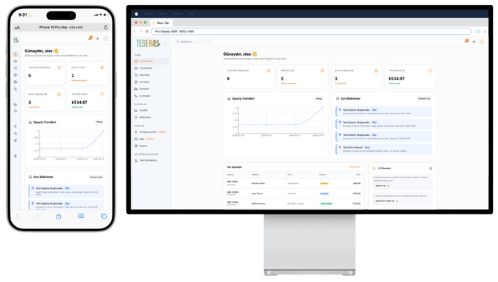
    </td>
    <td align="center" width="50%">
      <b>AI Assistant</b><br/>
      Conversational AI powered by Gemini 1.5 Flash with chat history, starter prompts, and markdown rendering.
      <br/><br/>
      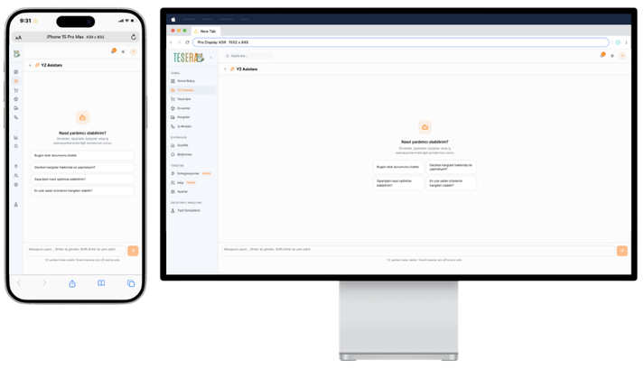
    </td>
  </tr>
  <tr>
    <td align="center" width="50%">
      <b>Order Management</b><br/>
      Full order table with status badges, customer info, filters, and inline actions.
      <br/><br/>
      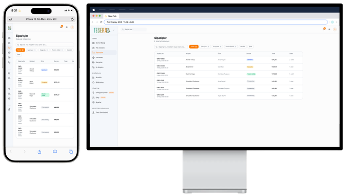
    </td>
    <td align="center" width="50%">
      <b>Inventory Management</b><br/>
      Product table with low-stock and critical-stock alerts, CSV import/export, edit/delete actions.
      <br/><br/>
      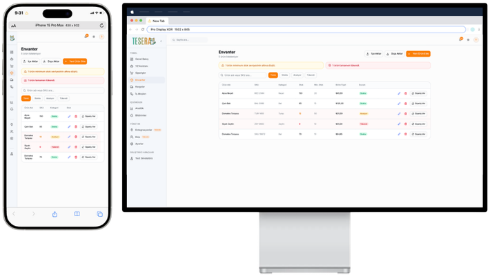
    </td>
  </tr>
  <tr>
    <td align="center" width="50%">
      <b>Shipment Tracking</b><br/>
      Shipment list with carrier info, tracking codes, delay warnings, and status management.
      <br/><br/>
      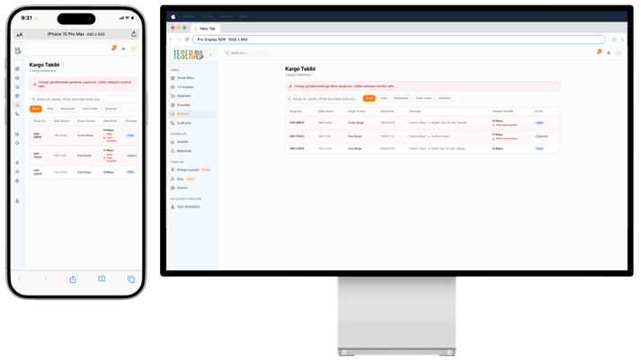
    </td>
    <td align="center" width="50%">
      <b>Workflow Builder</b><br/>
      Card-based agent workflow builder with trigger types, step management, and active/inactive toggling.
      <br/><br/>
      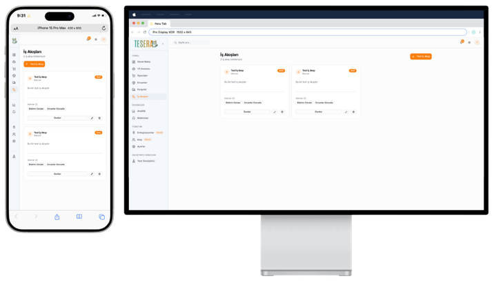
    </td>
  </tr>
  <tr>
    <td align="center" width="50%">
      <b>Analytics & AI Predictions</b><br/>
      Order trends, inventory by category, shipment status charts, and AI-generated business predictions sidebar.
      <br/><br/>
      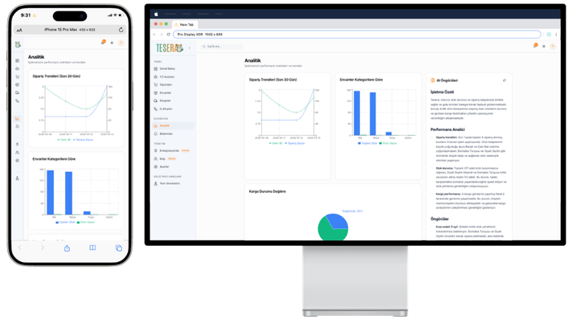
    </td>
    <td align="center" width="50%">
      <b>Notification Center</b><br/>
      Full notification lifecycle with priority badges, mark-as-read, bulk delete, and type icons per module.
      <br/><br/>
      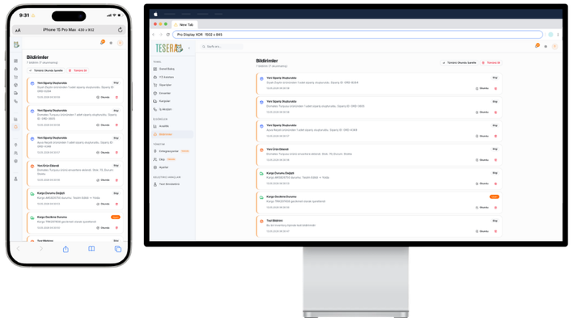
    </td>
  </tr>
  <tr>
    <td align="center" width="50%">
      <b>Integrations</b><br/>
      Marketplace integrations page with Trendyol, Hepsiburada, and Amazon cards (Coming Soon).
      <br/><br/>
      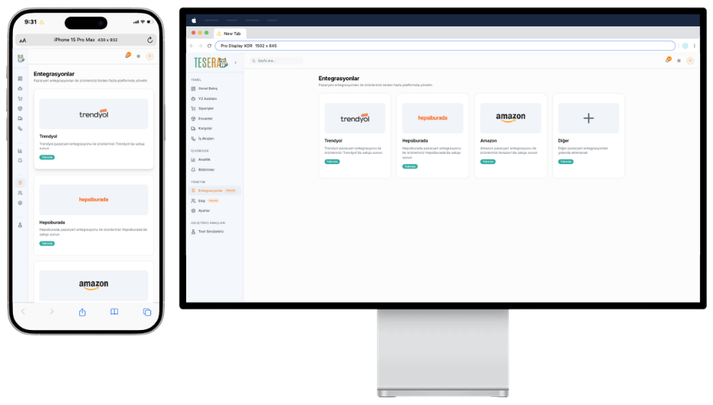
    </td>
    <td align="center" width="50%">
      <b>Team Management</b><br/>
      Team module coming soon page with feature preview cards.
      <br/><br/>
      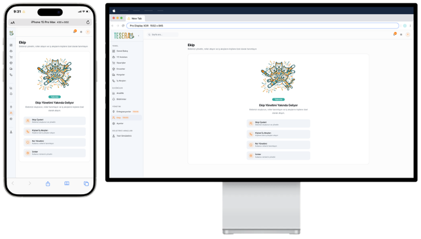
    </td>
  </tr>
  <tr>
    <td align="center" width="50%">
      <b>Settings — Profile & Company</b><br/>
      Unified settings with profile info, company details, profile completion indicator, and danger zone.
      <br/><br/>
      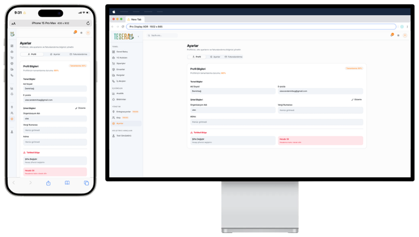
    </td>
    <td align="center" width="50%">
      <b>Test Simulator Panel</b><br/>
      Developer tool with 8 modules for seeding data, simulating orders/carriers, and testing AI/notifications.
      <br/><br/>
      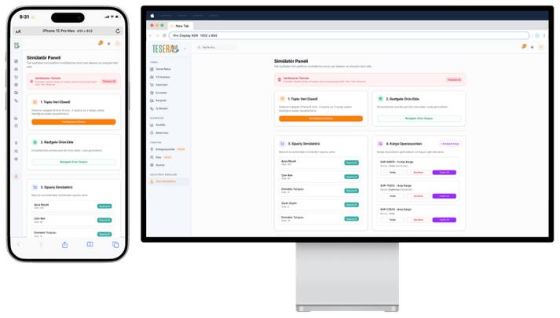
    </td>
  </tr>
</table>

---

## 🏗️ Architecture

| Layer | Technology |
|---|---|
| **Frontend** | Next.js 15 (App Router), TypeScript, TailwindCSS, shadcn/ui v4, Framer Motion |
| **Backend** | FastAPI, Python, SQLAlchemy, SQLite (dev) / PostgreSQL (prod) |
| **AI Layer** | Google Gemini 1.5 Flash (primary), OpenAI GPT-4o Mini (fallback) |
| **Charts** | Recharts |
| **Auth** | JWT + Bcrypt + SMTP email verification |
| **UI Components** | Lucide Icons, react-markdown, remark-gfm, Tailwind Typography |

---

## 🗄️ Database Structure

Currently, the backend runs on **SQLite** (`tesera.db`) for rapid local development. Swap to PostgreSQL in production by updating `DATABASE_URL` in `.env` / `core/config.py`.

### Entity Relationship Diagram (ERD)

The platform uses a **multi-tenant B2B architecture** — every operational record is scoped to a `Company`. Users authenticate to manage resources belonging exclusively to their company.

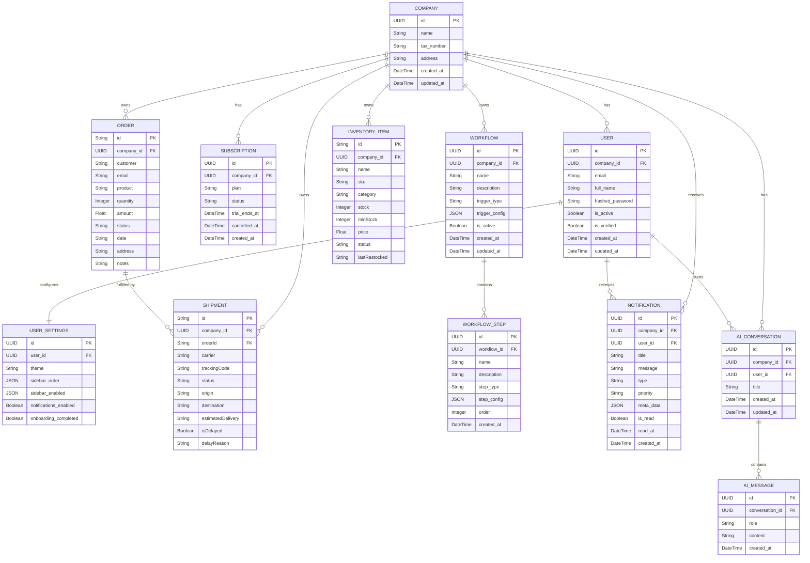

---

## 📐 Use Case Diagrams

### Order Management

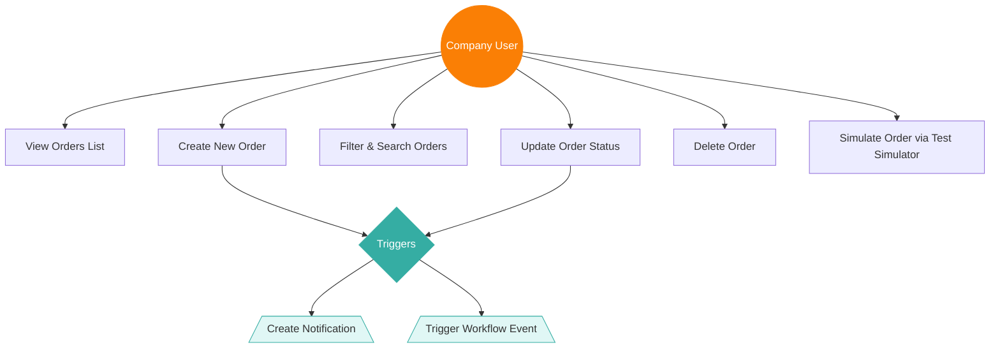

### Inventory Management

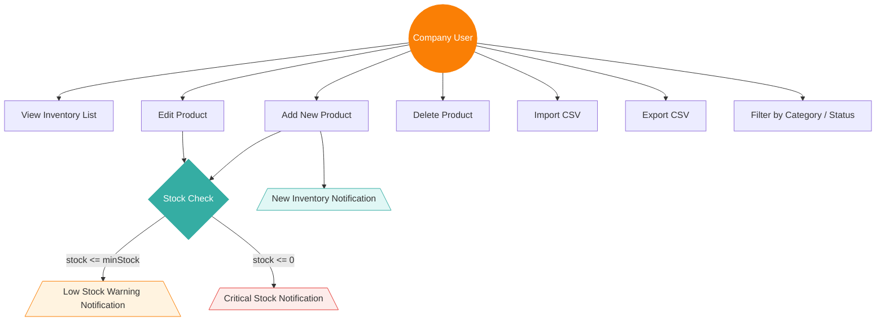

### Workflow Builder

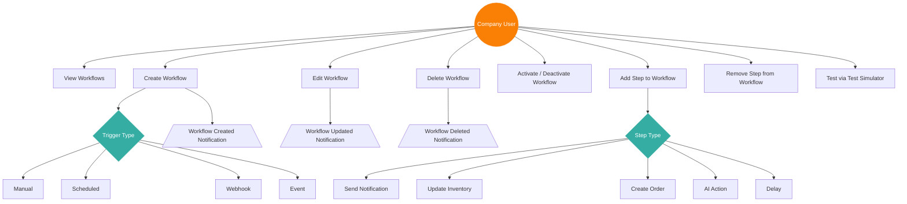

### Notification Center

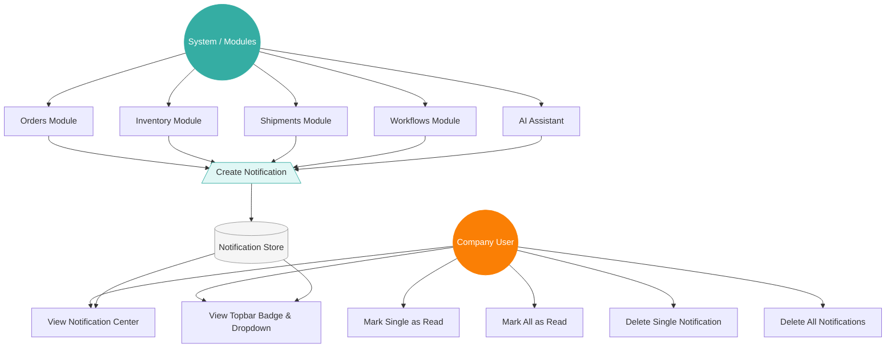

### Shipment Tracking

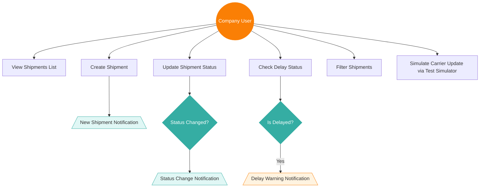

---

## 🔐 Authentication Flow

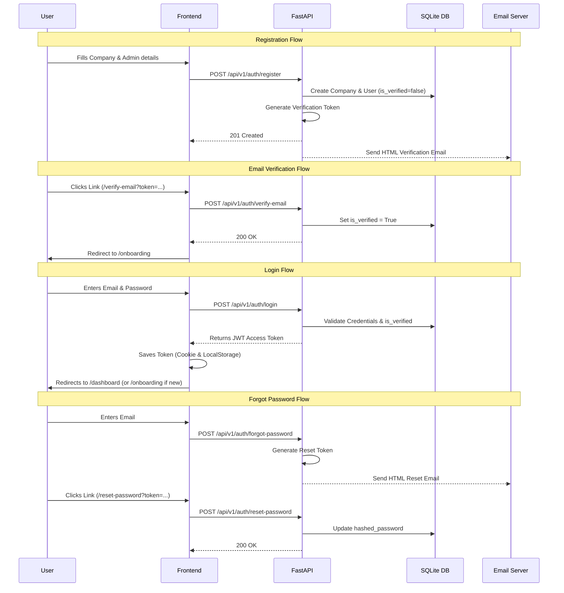

---

## 📁 Project Structure

```
tesera/
├── frontend/               # Next.js 15 (App Router) application
│   └── src/
│       ├── app/            # Route segments (landing, auth, dashboard)
│       ├── components/     # Reusable UI components & sections
│       ├── data/           # Static data & config
│       └── types/          # TypeScript type definitions
├── backend/                # FastAPI application
│   └── app/
│       ├── api/            # Route handlers (auth, orders, inventory, etc.)
│       ├── agents/         # AI agent logic
│       └── core/           # Config, DB, dependencies
├── docker/                 # Docker Compose configs (planned)
└── memory-bank/            # Project context & development rules
```

### Dashboard Routes

| Route | Module |
|---|---|
| `/dashboard` | Overview & KPIs |
| `/dashboard/orders` | Order Management |
| `/dashboard/inventory` | Inventory Management |
| `/dashboard/shipments` | Shipment Tracking |
| `/dashboard/ai-assistant` | AI Chat Assistant |
| `/dashboard/workflows` | Workflow Builder |
| `/dashboard/analytics` | Analytics & Charts |
| `/dashboard/notifications` | Notification Center |
| `/dashboard/integrations` | Marketplace Integrations |
| `/dashboard/team` | Team Management *(Coming Soon)* |
| `/dashboard/settings` | Settings (Profile, Preferences, Billing) |
| `/dashboard/test` | Developer Test Simulator |

---

## 🧪 Test Simulator

A built-in developer tool at `/dashboard/test` for generating mock data and testing all platform features without manual data entry.

| Module | Description |
|---|---|
| **1 — Bulk Seed** | Fills DB with randomised inventory, orders, and shipments |
| **2 — Random Product** | Instantly adds a random inventory product |
| **3 — Random Shipment** | Creates a random shipment for an existing order |
| **4 — Order Simulator** | Lists inventory and places customer orders per product |
| **5 — Carrier Interface** | Simulates carrier status updates and delay triggers |
| **6 — AI Assistant Test** | Verifies Gemini/OpenAI API connection inline |
| **7 — Workflow Test** | Generates sample workflows with test steps |
| **8 — Notification Test** | Creates sample notifications with random types/priorities |
| **Clear All** | Wipes all company data (inventory, orders, shipments, workflows, notifications, AI history) |

---

## 🚀 Development Setup

### Prerequisites
- Node.js 18+
- Python 3.10+
- A Gemini API Key (`GEMINI_API_KEY`) and optionally an OpenAI key (`OPENAI_API_KEY`)
- SMTP credentials for email (Gmail supported via `USE_GMAIL_SMTP=true`)

### Frontend

```bash
cd frontend
cp .env.example .env.local   # configure NEXT_PUBLIC_API_URL
npm install
npm run dev                  # http://localhost:3000
```

### Backend

```bash
cd backend
python -m venv venv
source venv/bin/activate     # Windows: venv\Scripts\activate
cp .env.example .env         # fill in secrets
pip install -r requirements.txt
uvicorn app.main:app --reload  # http://localhost:8000
```

> **Optional seed:** `python seed.py` — populates the database with demo data.

---

## 👥 Team

The people who built Tesera:

<table>
  <tr>
    <td align="center">
      <b>Yusuf Atas</b><br/>
      CEO & DevOps Engineer<br/>
      <a href="https://linkedin.com/in/yusuf-atas34">LinkedIn</a> · <a href="https://github.com/yusufatass">GitHub</a>
    </td>
    <td align="center">
      <b>Ulas Can Demirbag</b><br/>
      CTO & Fullstack Engineer<br/>
      <a href="https://www.linkedin.com/in/ulascandemirbag/">LinkedIn</a> · <a href="https://github.com/ulascan54">GitHub</a>
    </td>
    <td align="center">
      <b>Sedef Esra Kazan</b><br/>
      CBD & Business Development & Marketing<br/>
      <a href="https://www.linkedin.com/in/sedef-kazan-a90400332/">LinkedIn</a> · <a href="https://github.com/sedefkazan">GitHub</a>
    </td>
  </tr>
</table>

---

## 📄 License

This project is licensed under the **MIT License** — see the [LICENSE](LICENSE) file for details.

```
MIT License — Copyright (c) 2026 Tesera (Yusuf Atas, Ulas Can Demirbag, Sedef Esra Kazan)
```
