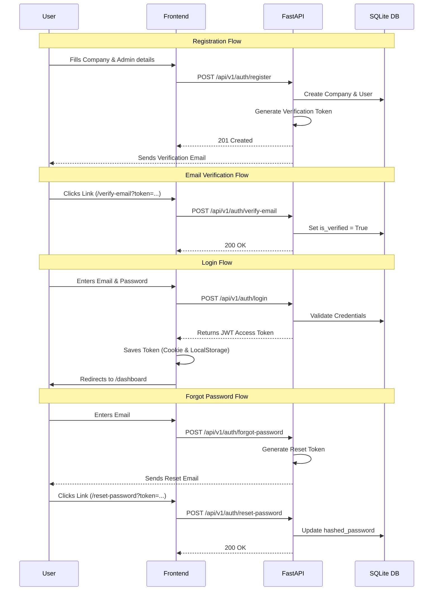

# Tesera

Tesera is an AI-powered operations assistant platform designed for SMEs, cooperatives, boutique e-commerce businesses, and hybrid physical-online sellers.

## Overview

Tesera automates:
- Customer communication (WhatsApp, Chat, Email)
- Shipment management and tracking
- Inventory and stock tracking
- Workflow operations and task assignment
- Operational analytics

## Architecture

- **Frontend:** Next.js (App Router), TypeScript, TailwindCSS, shadcn/ui.
- **Backend:** FastAPI, Python, PostgreSQL, Redis, Celery.
- **AI Layer:** OpenAI-compatible APIs, agent-based workflows, tool calling, RAG.

### Database Structure

Currently, the backend runs on **SQLite** (`tesera.db`) to enable rapid local development without requiring a Dockerized PostgreSQL setup. This can be easily swapped to PostgreSQL in production by modifying the `DATABASE_URL` in `.env` / `core/config.py`.

**Core Entities:**
- **Company:** `id` (UUID), `name` (String), `created_at` (DateTime), `updated_at` (DateTime)
- **User:** `id` (UUID), `company_id` (UUID - Foreign Key), `email` (String), `full_name` (String), `hashed_password` (String), `is_active` (Boolean), `is_verified` (Boolean)

*Relationships:* A Company can have multiple Users. Users are authenticated and operated within their company context.

### Authentication Flow

## Project Structure

- `/frontend` - Next.js application
- `/backend` - FastAPI application
- `/docker` - Docker compose and configurations (Planned)
- `/memory-bank` - Project documentation and rules (Cline's memory)

## Development Setup

### Frontend

1. `cd frontend`
2. Copy `.env.example` to `.env.local`
3. `npm install`
4. `npm run dev`

### Backend

1. `cd backend`
2. Create a virtual environment: `python -m venv venv`
3. Activate it: `source venv/bin/activate`
4. Copy `.env.example` to `.env`
5. `pip install -r requirements.txt`
6. `uvicorn app.main:app --reload`

## License

Proprietary.
